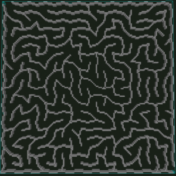
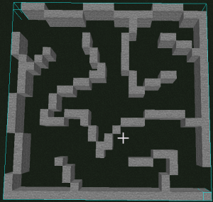

# SnubSquare shape maze schematic generator

## Run the program using following arguments:
- ***--output="out/maze.nbt"*** - _Output file path_
- ***--width=20*** - _Maze width (not actual schematic size)_
- ***--height=20*** - _Maze height (not actual schematic size)_
- ***--scale=5*** - _Scale factor_
- ***--help*** - _Print help message_




# Usage without creating `.jar` file.

```bash
./gradlew run --args="--output=out/maze.nbt --width=20 --height=20 --scale=5"
```

# Usage of `.jar` file.

## Compile the project
```bash
./gradlew shadowJar -PoutputDir=out
```

## Run the program
```bash
java -jar out/maze2schema-1.1.jar --output="out/maze.nbt" --width=20 --height=20 --scale=5
```