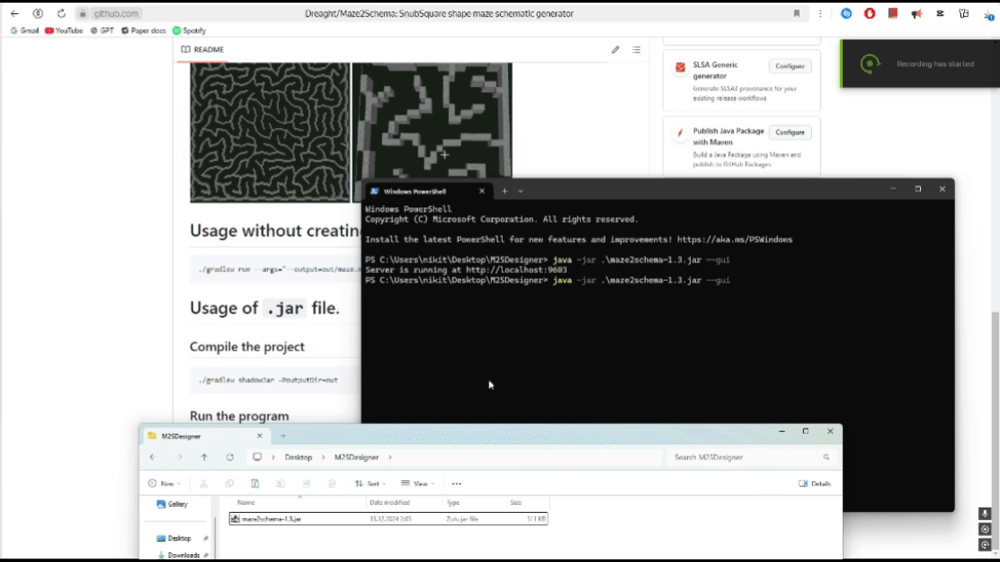

# SnubSquare shape maze schematic generator

## Run the program using following arguments:
- ***--output="out/maze.nbt"*** - _Output file path_.
Replacements:
  - %SEED% - _seed_.
  - %WIDTH% - _width_.
  - %HEIGHT% - _height_.
  - **Example**: `--output=out/%SEED%_%WIDTH%x%HEIGHT%.nbt`
- ***--width=20*** - _Maze width (not actual schematic size)_
- ***--height=20*** - _Maze height (not actual schematic size)_
- ***--scale=5*** - _Scale factor_
- ***--gui*** - _Start as the GUI server_
- ***--seed=0*** - _Seed for the maze generation_
- ***--help*** - _Print help message_


# Run in GUI mode: `--gui` argument!

* `.nbt` - Saved in real time!
* **Scale**: Scroll the mouse; **Resize**: Move sliders.

# [CLI] Usage without creating `.jar` file.

```bash
./gradlew run --args="--output=out/maze.nbt --width=20 --height=20 --scale=5"
```

# [CLI] Usage of `.jar` file.

## Compile the project
```bash
./gradlew shadowJar -PoutputDir=out
```

## Run the program
```bash
java -jar out/maze2schema-1.4-SNAPSHOT.jar --output="out/maze.nbt" --width=20 --height=20 --scale=5
```
